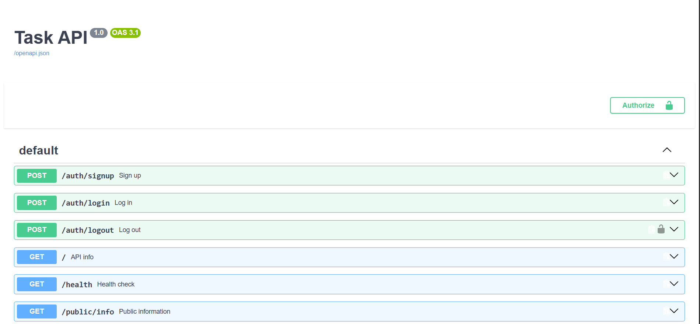
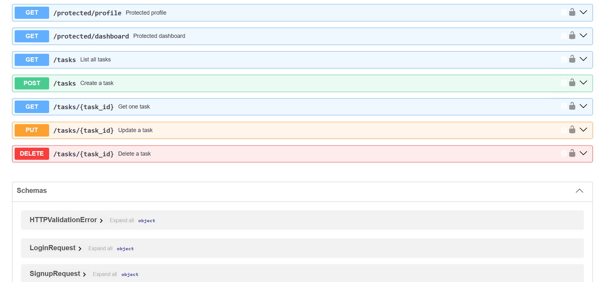
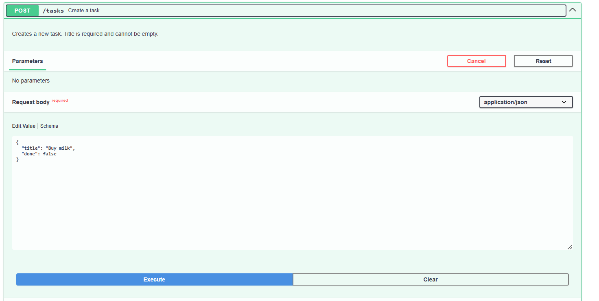
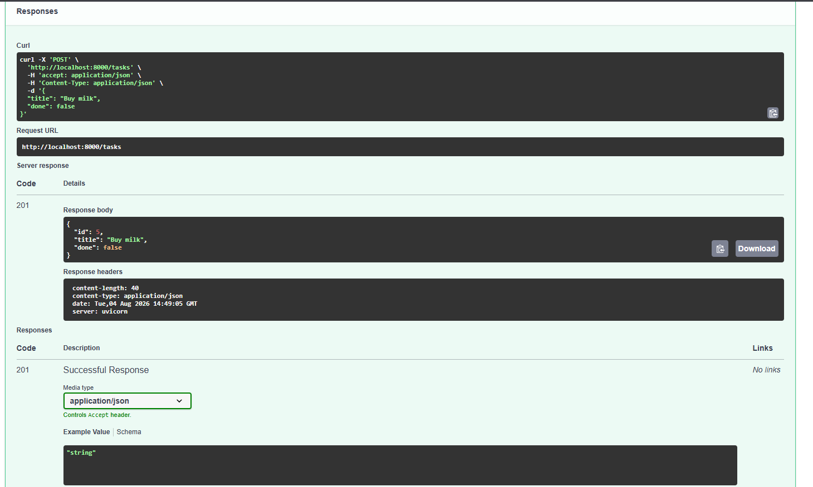
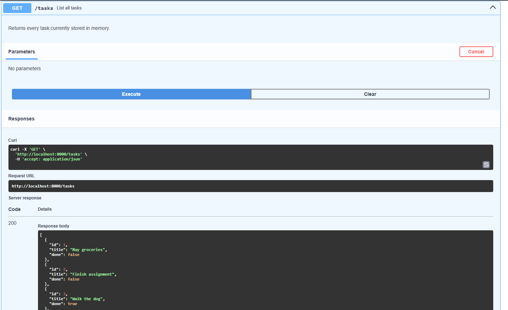
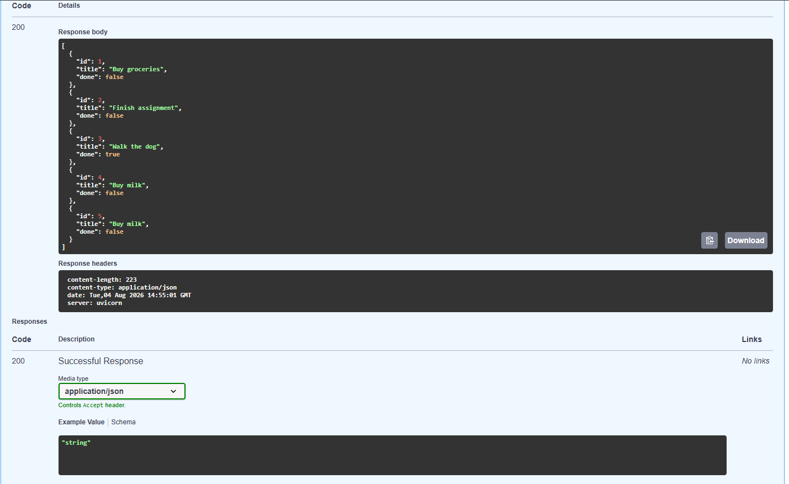
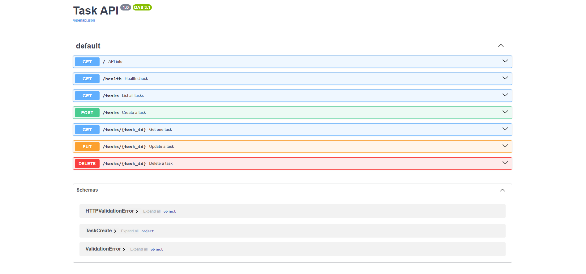
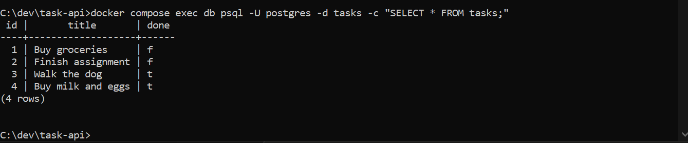
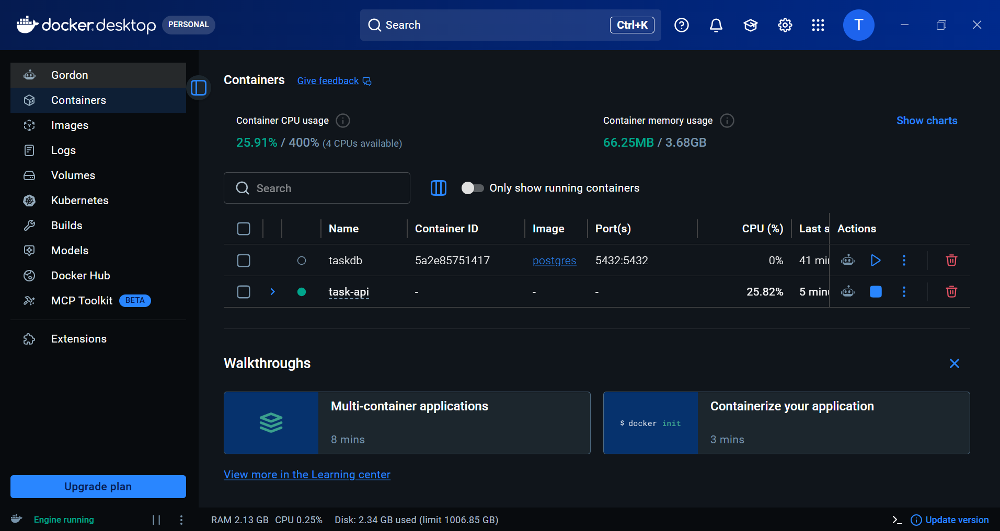
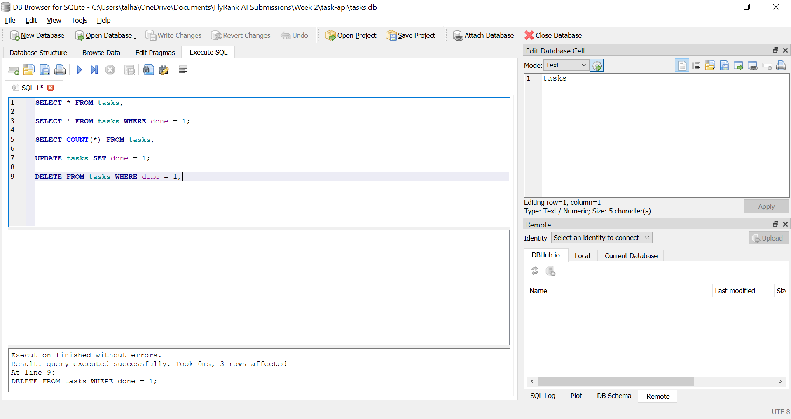

# Backend AI Assignments

Secure, production-style backend systems built during the **FlyRank Backend AI Engineering Internship**. This repository is a single growing FastAPI application — starting from a plain in-memory CRUD API in Week 2 and evolving, stage by stage, into a service with Supabase JWT authentication, PostgreSQL persistence, an LLM-powered classification endpoint, a SQL-driven PDF report generator, and Inngest-based asynchronous background jobs. It also contains two standalone side projects built during the same track: a polite, schema-validated web scraper, and a full visual AI workflow builder (React Flow + Inngest + Groq).

**Author:** Muhammad Talha ([@Talha2503](https://github.com/Talha2503))
**Track:** FlyRank Backend AI Engineering Internship — Weeks 2–7

---

## Table of Contents

1. [Repository Structure](#repository-structure)
2. [Tech Stack](#tech-stack)
3. [Assignment Map](#assignment-map)
4. [Core Task API](#1-core-task-api-root)
5. [Background Jobs with Inngest](#2-background-jobs-with-inngest-background-jobs)
6. [The Polite Scraper](#3-the-polite-scraper-scraper)
7. [AI Decision Flow](#4-ai-decision-flow-decision-flow)
8. [AI Rematch Versions](#5-ai-rematch--ai-version-versions)
9. [Environment Variables](#environment-variables)
10. [Security](#security)
11. [What I'd Fix With Another Day](#what-id-fix-with-another-day)
12. [License](#license)

---

## Repository Structure

```text
Backend-AI-Assignments/
├── main.py                        # Core FastAPI app (tasks, auth, LLM, reports)
├── database.py                    # PostgreSQL connection/session setup
├── supabase_client.py             # Supabase Auth client
├── report_data.py                 # SQL aggregation queries for PDF reports
├── report_db.py                   # SQLite report metadata storage
├── report_renderer.py             # HTML → PDF rendering (Playwright)
├── seed.py                        # Seeds report.db with sample orders
├── requirements.txt
├── Dockerfile
├── compose.yaml
├── .env.example
├── .gitignore
├── README.md
│
├── background-jobs/                # Inngest asynchronous report processing
│   ├── main.py
│   ├── requirements.txt
│   ├── README.md
│   └── Inngest Server Screenshot*.PNG
│
├── scraper/                        # W5 · A9 — The Polite Scraper
│   └── (fetch → extract → normalize → validate → store → report pipeline)
│
├── decision-flow/                  # Bonus project — AI Decision Flow (Next.js)
│   ├── app/ · components/ · lib/ · inngest/
│   ├── The Flow.png
│   ├── The Flow 2.png
│   └── README.md
│
├── ai-version-docker/              # AI-rematch bonus code (kept isolated from hand-built work)
│
├── evals/
│   ├── cases.json                  # 8-case eval set for the LLM endpoint
│   └── run_eval.py
│
├── src/
│   ├── llm/
│   │   ├── client.py · parser.py · quarantine.py · schema.py
│   └── prompts/
│       └── support-v1.md           # Versioned system prompt
│
├── logs/                           # quarantine.jsonl (invalid LLM outputs)
│
├── reports/                        # Generated PDFs (gitignored)
├── report.db                       # SQLite reporting DB (gitignored)
│
├── Docker-screenshot.PNG
├── db-browser-screenshot.PNG
├── postgres-screenshot.png
├── swagger-authenticated.PNG
├── swagger-protected-routes.PNG
├── swagger-create-task-1.PNG
├── swagger-create-task-2.PNG
├── swagger-get-tasks-1.PNG
├── swagger-get-tasks-2.PNG
├── swagger-screenshot.PNG
├── report-page-1.png
└── JOB-CARD.md
```

---

## Tech Stack

| Layer | Technology |
|---|---|
| API framework | FastAPI (Python) |
| Database | PostgreSQL (Docker, persistent volume) + SQLite (reporting) |
| Authentication | Supabase Auth — JWT, bearer tokens, protected routes |
| LLM provider | OpenAI-compatible client (env-configurable base URL/model) |
| Background jobs | Inngest (event-driven, cron, retries with backoff) |
| PDF generation | Playwright (HTML → PDF, headless Chromium) |
| Scraping | Requests/BeautifulSoup-style pipeline against a practice sandbox |
| Decision Flow UI | Next.js 16, React Flow, Tailwind v4, Shadcn/ui |
| Decision Flow LLM | Groq (OpenAI-compatible SDK), `openai/gpt-oss-20b` |
| Containerization | Docker + Docker Compose |
| API docs | Swagger UI (`/docs`) with Bearer auth support |

---

## Assignment Map

| Week | Assignment | Focus | Status |
|---|---|---|---|
| W2 · A1 | Build your first CRUD API | In-memory CRUD, Swagger, GitHub | ✅ Complete |
| W3 | Connecting CRUD to a database | SQLite → Postgres migration | ✅ Complete |
| W3 | Containerize your stack | Docker Compose, Postgres in Docker | ✅ Complete |
| W2 · A4 | Auth · Login & protect | Supabase JWT, protected routes, middleware | ✅ Complete |
| W4 · A8 | PDF report generator | SQL aggregation, HTML→PDF, idempotent reports | ✅ Complete |
| W5 · A9 | The polite scraper | Fetch/extract/normalize/validate/store/report | ✅ Complete |
| W7 · A17 | Put an LLM behind your API | Structured LLM output, retries, kill switch, evals | ✅ Complete |
| W7 · Background Jobs | Inngest async processing | 202 pattern, polling, retries, cron | ✅ Complete |
| Bonus | AI Decision Flow | React Flow + Inngest + Groq visual workflow engine | ✅ Complete (4/4 phases) |
| Bonus | AI vs Me rematches | AI-generated code reviewed against hand-built code | ✅ Complete (isolated in `ai-version-docker/`) |

---

## 1. Core Task API (root)

A secure REST API combining task management, authentication, LLM classification, and PDF reporting.

### What this is

- FastAPI REST API with full task CRUD
- PostgreSQL persistence running in Docker with a named volume
- Supabase Authentication — signup, login, logout, JWT verification
- Reusable authentication dependency guarding protected routes
- LLM-powered customer support classification with schema validation and repair
- SQLite-backed PDF report generator with aggregation queries and idempotent generation
- Interactive Swagger documentation with Bearer auth support

### Authentication

| Method | Endpoint | Description | Auth |
|---|---|---|---|
| POST | `/auth/signup` | Create a new Supabase user | No |
| POST | `/auth/login` | Authenticate, receive access/refresh tokens | No |
| POST | `/auth/logout` | Log out the current user | Yes |
| GET | `/protected/profile` | Authenticated user info | Yes |
| GET | `/protected/dashboard` | Example protected route | Yes |
| GET | `/public/info` | Public information | No |

The authentication dependency extracts the Bearer token, verifies it with Supabase, rejects missing/invalid/expired/tampered tokens with `401`, and attaches the authenticated user to the request. It is reused across every protected route rather than duplicated.

**Swagger — Bearer authentication**


**Protected routes (lock icons in Swagger)**


### Task CRUD

| Method | Endpoint | Description | Auth | Success |
|---|---|---|---|---|
| GET | `/tasks` | List all tasks | Yes | 200 |
| GET | `/tasks/{id}` | Get one task | Yes | 200 |
| POST | `/tasks` | Create a task | Yes | 201 |
| PUT | `/tasks/{id}` | Update a task | Yes | 200 |
| DELETE | `/tasks/{id}` | Delete a task | Yes | 204 |

**Creating a task**



**Listing tasks**



**General Swagger overview**


### Database — PostgreSQL in Docker

PostgreSQL runs inside Docker and is reached through the Compose network. Data survives restarts via a named Docker volume.

```bash
docker compose exec db psql -U postgres -d tasks
```



**Docker build/up**


**DB Browser inspection (earlier SQLite stage)**


### Earlier storage stages

| Stage | Storage | Persistence |
|---|---|---|
| Week 2 | Python in-memory list | No |
| Week 3 | SQLite | Yes |
| Current project | PostgreSQL in Docker | Yes |
| Background Jobs assignment | Python in-memory report map | No |

The API contract stayed identical while the storage layer evolved underneath it.

### LLM Support Classification

```
POST /support/classify
```

**Input**
```json
{ "text": "I was charged twice for my subscription" }
```

**Output**
```json
{
  "category": "billing",
  "urgency": "normal",
  "confidence": 0.95,
  "reason": "The customer reports being charged twice for a subscription."
}
```

| Field | Type | Allowed values |
|---|---|---|
| `category` | enum | `billing`, `bug`, `feature`, `other` |
| `urgency` | enum | `low`, `normal`, `high` |
| `confidence` | float | 0.0–1.0 |
| `reason` | string | Explanation |

**Reliability pipeline:** call the LLM → extract JSON → parse → validate against the `SupportClassification` Pydantic schema → on failure, exactly **one** repair retry → if still invalid, return `422` and quarantine the response to `logs/quarantine.jsonl` → raw model text is **never** returned to the caller.

**Production safeguards:** explicit timeout (no 10-minute SDK default), retries limited to timeouts/`429`/`5xx` (never `400`/`401`/`403`), exponential backoff with jitter, `Retry-After` respected, structured cost/usage logging (tokens, duration, repair count), and an `LLM_ENABLED=false` kill switch that returns a deterministic fallback with zero model calls.

**Evaluation result** (`evals/cases.json`, prompt version `support-v1`, run August 25, 2026):

| Case | Result |
|---|---|
| 1–3 | PASS |
| 4–6 | FAIL |
| 7–8 | PASS |

**Score: 5/8 (62.5%)** — all three failures were urgency misclassifications, not category errors. Recorded as an honest baseline for future prompt iteration.

### PDF Report Generator

SQLite-backed reporting pipeline over an orders dataset, aggregated in `report_data.py`:

```sql
SELECT COUNT(*) AS total_orders FROM orders;

SELECT SUM(amount) AS total_revenue, AVG(amount) AS average_order_amount FROM orders;

SELECT product, SUM(amount) AS revenue FROM orders
GROUP BY product ORDER BY revenue DESC LIMIT 5;

SELECT DATE(created_at) AS date, COUNT(*) AS orders FROM orders
WHERE DATE(created_at) >= DATE('now', '-6 days')
GROUP BY DATE(created_at) ORDER BY date ASC;
```

| Method | Endpoint | Description | Success |
|---|---|---|---|
| POST | `/reports` | Generate (or reuse) today's report | 201 / 200 |
| GET | `/reports/{id}` | Report metadata | 200 |
| GET | `/reports/{id}/file` | Download the PDF | 200 |

**Idempotency:** a normal repeated `POST /reports` on the same day returns the existing report with `200 OK` instead of generating a duplicate. Passing `{"force": true}` intentionally creates a fresh report and a new `201`. Verified live: two rapid POSTs returned the same report ID, and the `reports/` folder gained exactly one file.

**Generated PDF — page 1**


### How to run it

```bash
copy .env.example .env
# add your Supabase + LLM credentials

docker compose up --build
```

- API: `http://localhost:8000`
- Swagger UI: `http://localhost:8000/docs`

```bash
docker compose down        # stop
docker compose down -v     # stop and wipe the DB volume
```

Seed the reporting database separately:

```bash
python seed.py
```

---

## 2. Background Jobs with Inngest (`background-jobs/`)

Demonstrates the **fast-door pattern**: accept a request immediately, do slow work in the background, let the client poll for status.

### Inngest functions

| Function | Trigger | Purpose |
|---|---|---|
| `say-hello` | `test/hello` | Initial connectivity test |
| `make-report` | `report/requested` | Asynchronous report generation (2 steps: `do-the-slow-work`, `build-report`) |
| `heartbeat` | `* * * * *` (cron) | Runs every minute, summarizes pending/done/failed report counts |

### API

| Method | Endpoint | Description | Success |
|---|---|---|---|
| POST | `/reports` | Queue an asynchronous report | 202 |
| GET | `/reports/{id}` | Poll report status | 200 |
| GET | `/health` | Health check | 200 |

**Workflow:**
```
Client → POST /reports → 202 Accepted (status: pending)
Inngest → make-report → do-the-slow-work (8s) → build-report → status: done
Client → GET /reports/{id} → polls until status flips to "done"
```

An unknown report ID returns `404`. A missing `topic` is rejected with `400` **before** any Inngest event is sent — bad input is rejected at the door; only genuinely transient failures get retried.

**Retries & backoff:** `make-report` is configured with `retries = 2` (initial attempt + 2 retries, increasing backoff). A `topic` of `"fail"` was used to intentionally trigger and verify this — the Inngest dashboard showed the run failing 3 times with a final `FAILED` status.

**Cron:** the `heartbeat` function runs every minute (`* * * * *`) purely off the clock, no HTTP trigger required, and was verified running repeatedly in the dashboard.

### Running it (2 terminals)

```bash
# Terminal 1
cd background-jobs
uvicorn main:app --reload --port 8000

# Terminal 2
npx inngest-cli@latest dev
```

Inngest dev dashboard: `http://localhost:8288`

### Inngest dashboard evidence


### Verification checklist

| Checkpoint | Result |
|---|---|
| Inngest connected to FastAPI | ✅ |
| All 3 functions discovered | ✅ |
| `POST /reports` → `202` | ✅ |
| Status polling works | ✅ |
| Unknown ID → `404` | ✅ |
| Failed report triggers retries with backoff | ✅ |
| Missing topic rejected before event send | ✅ |
| Cron heartbeat runs every minute | ✅ |

Note: background-job state is intentionally kept **in memory** — it is lost on restart. This is a deliberate demonstration of the async pattern, not a production storage choice.

---

## 3. The Polite Scraper (`scraper/`)

A respectful, schema-validated scraping pipeline against [Books to Scrape](https://books.toscrape.com), a public sandbox built for practice.

**Pipeline:** `classify target → fetch (cached) → discover 3 catalogue pages → extract 60 raw book records → normalize/validate → store books.json → report`

- Identifies itself with an honest `User-Agent`, checks `robots.txt` before scraping, uses timeouts, and waits ≥500ms between real requests
- Caches every fetched page locally so development never re-hits the live site
- Converts relative → absolute URLs properly (never by string concatenation)
- Normalizes raw fields (e.g. `"£51.77"` → `price_gbp: 51.77`) while keeping the raw text alongside the clean value
- Every record carries **provenance**: `source_page` and `fetched_at`
- Records are schema-validated before storage; failures are quarantined to `errors.json` with a reason, never silently dropped
- Idempotent: re-running the scraper produces the same 60 unique records, not duplicates
- One deliberately broken URL is logged and skipped without taking down the run — 59+ good records survive
- Every run ends with `run-report.json`: start time, duration, pages fetched, cache hits, valid/invalid record counts, failed pages

**Ethics note:** only public sandbox targets are scraped; no logins, paywalls, or blocks are bypassed; an official API is preferred whenever one exists.

---

## 4. AI Decision Flow (`decision-flow/`)

A visual AI workflow builder — each node is a decision step that evaluates a natural-language prompt against an LLM and returns a strict **YES/NO**, branching the workflow accordingly. Built as a bonus project during Week 7.

**Status:** Complete — all 4 phases built, tested, and pushed.

### Tech stack

| Layer | Technology |
|---|---|
| Framework | Next.js 16 (App Router, TypeScript, Tailwind v4) |
| Visual canvas | React Flow |
| Workflow orchestration | Inngest (local dev server) |
| LLM provider | Groq (OpenAI-compatible SDK), model `openai/gpt-oss-20b` |
| UI components | Shadcn/ui (Radix UI, Nova preset) |
| Persistence | Browser `localStorage` (graph state) + in-memory run store (execution status) |

### Phases

**Phase 1 — Setup:** scaffolded Next.js inside `/decision-flow`, installed React Flow, Inngest, the OpenAI SDK, and Shadcn; configured `.env.local` for the Groq key.

**Phase 2 — Foundations:** built the interactive canvas — a custom `DecisionNode` with an editable prompt textarea and two labeled YES/NO output handles. Users can add nodes, drag-connect them; edges are color-coded and labeled by branch. Full graph state persists to `localStorage`.

**Phase 3 — Core execution:** built the actual workflow engine. An Inngest function (`run-decision-flow`) walks the graph from a starting node — sends each node's prompt to Groq with a system instruction forcing a one-word YES/NO answer, records the result, follows the matching edge, repeats (capped at 20 steps to prevent infinite loops). Execution status is tracked in an in-memory store keyed by run ID and exposed via a polling API.

**Phase 4 — Polish** (4 enhancements, exceeding the required 3):
- Visual execution state — node borders glow blue while running, green for YES, red for NO
- Terminal-style execution log panel (macOS traffic-light dots, monospace, checkmark rows)
- Animated dashed line on the edge actually traversed during execution
- Improved node styling — status indicator dot, colored glow shadows, cleaner handles

**Workflow canvas / execution**


### Notable problems solved

- **Inngest API mismatch:** the installed version required triggers merged into the function's first config argument rather than passed separately — fixed by reading the runtime error directly.
- **Local dev mode:** Inngest defaulted to cloud mode; needed `INNGEST_DEV=1` in `.env.local` to run against the local dev server.
- **Deprecated model:** `llama-3.3-70b-versatile` was deprecated; migrated to `openai/gpt-oss-20b` per Groq's current recommendations.
- **Editor truncation bugs:** long multi-line pastes were getting cut mid-file, causing parser errors; resolved by condensing risky lines and rewriting affected files cleanly.
- **Edge-direction bug:** an edge was drawn from the wrong handle, silently breaking traversal — diagnosed with Inngest's dev server run inspector (Input/Output tabs) instead of guesswork.

### Repository state

5 commits pushed to `main`:
1. `566a9fd` — Phase 1: project setup
2. `284f01e` — Phase 2: canvas, editable nodes, YES/NO edges, persistence
3. `a534470` — Phase 3: Inngest execution + Groq decision logic
4. `74dd045` — Phase 4: execution log, animated edges, node styling
5. `f2365ab` — README update

---

## 5. AI Rematch / `ai-version-docker/`

Per the internship's "AI vs me" bonus stage, AI-generated versions of hand-built assignments are kept fully isolated in their own folder (`ai-version-docker/`) or branch rather than mixed into the hand-built submission. Each rematch involved:

1. Writing an original prompt from memory (without copying the assignment brief)
2. Generating the AI's version in quarantine
3. Running the same checkpoints against both versions
4. Diffing the two implementations (`git diff --no-index`) and documenting what the AI did better, what it got wrong or silently skipped, and what the original prompt failed to specify
5. One rematch — an improved prompt, regenerated once

This keeps every hand-built stage (Weeks 2–7) verifiably the candidate's own work, while still capturing the comparison exercise the program asks for.

---

## Environment Variables

```env
# Database
DATABASE_URL=postgres://postgres:dev@db:5432/tasks

# Supabase Auth
SUPABASE_URL=your_supabase_project_url
SUPABASE_KEY=your_supabase_anon_key

# LLM (support classification)
LLM_BASE_URL=your_provider_base_url
LLM_API_KEY=your_api_key
LLM_MODEL=your_model_name
LLM_ENABLED=true
LLM_STUB=

# Decision Flow (Groq)
GROQ_API_KEY=your_groq_api_key
INNGEST_DEV=1
```

Never commit real credentials. `.env` is git-ignored everywhere in this repo; `.env.example` files contain placeholder values only.

---

## Security

- `.env` is ignored by Git across every subproject; `.env.example` ships placeholders only
- Supabase Auth handles password hashing and token signing — no custom cryptography
- JWTs are verified via Supabase before any protected route executes; failed auth is never retried
- Database queries are parameterized throughout
- LLM output is treated as untrusted input: parsed, schema-validated, repaired once, quarantined on repeated failure — raw model text is never returned to a caller
- The LLM integration ships a kill switch (`LLM_ENABLED=false`) that can disable model calls without a deploy
- Generated report files and local SQLite databases are excluded from Git (`reports/`, `report.db`)
- The scraper only targets a public practice sandbox, respects `robots.txt`, and never bypasses logins or paywalls
- AI-generated ("rematch") code is kept fully isolated from hand-built submissions

---

## What I'd Fix With Another Day

- Improve the `support-v1` prompt's urgency classification rules and expand the eval set beyond 8 cases — all three current failures were urgency misclassifications, not category errors
- Add a database-level uniqueness constraint or transaction/locking strategy to the PDF report generator's idempotency check, to make it safe under multiple concurrent API workers
- Replace the Inngest background-job in-memory report map with persistent job storage so status survives API restarts and can be shared across workers

---

## GitHub

Public repository:
**https://github.com/Talha2503/Backend-AI-Assignments**

Contains the complete FlyRank Backend AI Engineering internship submission: Task API, Authentication, PostgreSQL, LLM support classification, PDF report generation, Inngest background jobs, the polite scraper, the AI Decision Flow bonus project, verification screenshots, and documentation.

---

## License

These projects was created for educational purposes as part of the FlyRank Backend AI Engineering internship.
```

